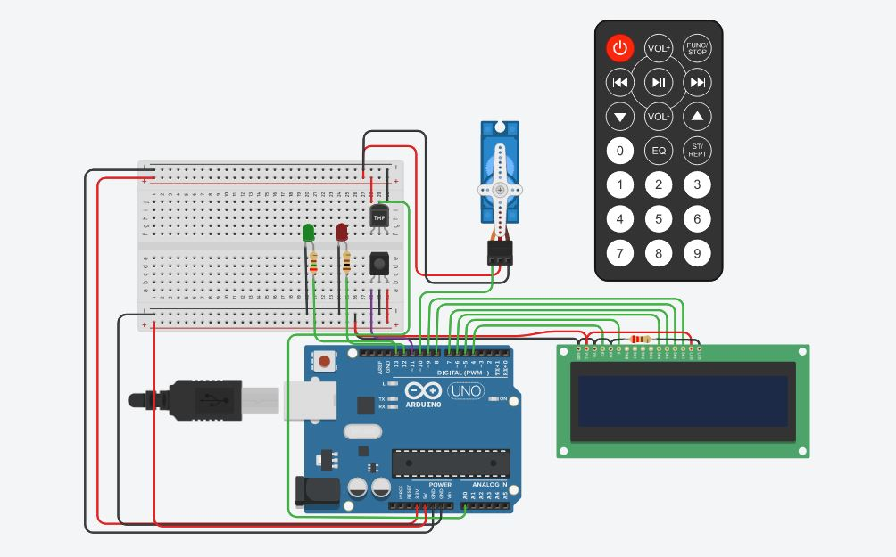
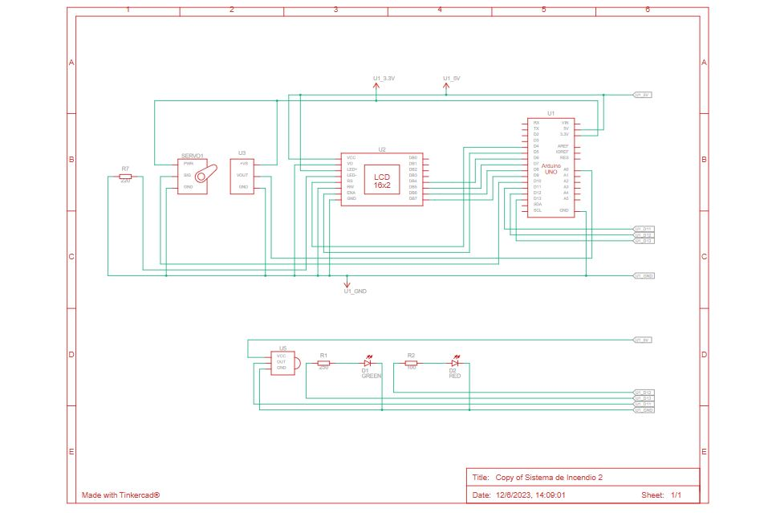

# Documentación 

## Integrantes 
- Farina Angel

## Proyecto: Sistema de Incendio - Arduino.

## Vista Esquemática

## Descripción
Es un sistema de alarma para incendios, el sistema muestra por defecto la temperatura ambiente. Con el control IR se puede establecer la estacion en la que nos encontramos, por lo cual esta definida una temperatura critica para cada estacion. Si la temperatura es estable, se muestra por pantalla la estacion y la temperatura actual. Si alcanza el estado critico, se activa la alarma apagando el led verde y encendiendo el rojo, tambien se activa el servo para que deje pasar el agua, mostrando todo lo sucedido por la pantalla LCD. Si la temperatura se pone estable nuevamente, se muestra el mensaje por pantalla y vuelvo todo a la normalidad.

## Función principal
El programa cuenta de varias funciones, una para detectar que boton se presiono y otra para manejar el sensor de temperaturas como principal.

Aca se comprueba la estacion de año seleccionada en el control IR y la temp actual con el sensor, dependiendo la estacion y la temp critica indicada por variables predefinidas, se puede indicar que hacer en cada ocación.

(Breve explicación de la función)

~~~ C++ (lenguaje en el que esta escrito)
void sensorTemp(int temp) {
  if (inicializacionCompleta && estacionSeleccionada != 0) {
    if (temp >= temperaturaCritica) {
      if (!servoActivado) {
        servoActivado = true;
        lcd.clear();
        lcd.print("Alarma activada");
        digitalWrite(LED_GREEN, LOW);
        digitalWrite(LED_RED, HIGH);
        myservo.write(180);
        delay(1000);
      }
    } else {
      if (servoActivado) {
        servoActivado = false;
        lcd.clear();
        lcd.print("Temperatura");
        lcd.setCursor(0, 1);
        lcd.print("Normal");
        digitalWrite(LED_RED, LOW);
        digitalWrite(LED_GREEN, HIGH);
        myservo.write(90);
        delay(1000);
      }
    }
  }

~~~

## :robot: Link al proyecto
- [proyecto](https://www.tinkercad.com/things/iGxalY338nD-sistema-de-incendio/editel?sharecode=LWF2JCK7LwS06zlWLrY1uYlrq-dABDe9hgAkmuF_nnw)

---
### Fuentes
- [Documentación Arduino](https://docs.arduino.cc/).

- [Markdown Cheatsheet](https://github.com/adam-p/markdown-here/wiki/Markdown-Cheatsheet).

- [Clase SPD](https://classroom.google.com/u/1/c/NTUyNTQ0MzQzNzY1).

---

